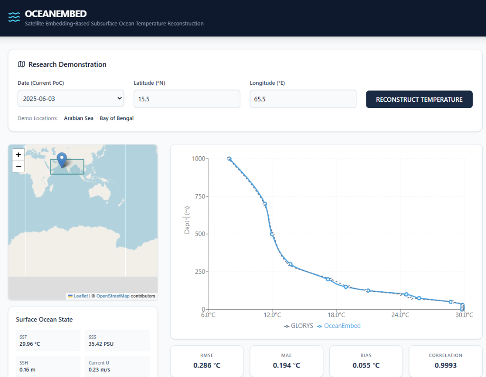

# 🌊 OceanEmbed: AI-Based Subsurface Ocean Temperature Reconstruction



> **🔴 LIVE DEMONSTRATION:** [**OceanEmbed SIH Dashboard**](https://blue-rangers-mgr-sih-26066.vercel.app)

OceanEmbed is an advanced oceanographic machine-learning project that reconstructs **3D subsurface ocean temperature profiles** from daily surface ocean satellite observations. This repository provides the complete **Smart India Hackathon (SIH) 2026** demonstration, featuring a high-performance Python FastAPI backend and an interactive React/TypeScript frontend visualization dashboard.

---

## 🎯 Problem Statement
Subsurface ocean temperature is difficult to observe continuously because in-situ subsurface observations (like ARGO floats or moorings) are sparse, costly, and limited in coverage. However, surface ocean variables—such as sea surface temperature, salinity, sea surface height, currents, and wind—contain vital spatial footprint signals indicative of the vertical temperature structure beneath. 

**OceanEmbed** acts as an AI bridge, leveraging Deep Learning to understand the complex, non-linear relationships between these multi-variate surface footprint patterns and the subsurface temperature profile, providing a scalable and continuous 3D temperature reconstruction model.

## 🔬 Scientific Demonstration Details
- **Study Region:** North Indian Ocean (Latitude: 5°N to 30°N | Longitude: 45°E to 105°E)
- **Spatial Resolution:** 0.25° × 0.25° grid
- **Temporal Resolution:** Daily
- **Demonstration Period:** 15 Days (2025-06-01 to 2025-06-15)
- **Model Architecture:** CNN-based Proof of Concept (Patch-based, 15×15 local spatial neighborhood extraction)
- **Output Depths:** 15 standard levels (0, 5, 10, 20, 30, 50, 75, 100, 125, 150, 200, 300, 500, 700, 1000m)

## 📡 Input Surface Variables
The model uses exactly seven surface variables harmonized to a daily 0.25° grid footprint. A 15×15 matrix of these variables forms the spatial input context:
1. **SST** (Sea Surface Temperature - OSTIA)
2. **SSS** (Sea Surface Salinity - Satellite product)
3. **SSH** (Sea Surface Height / SLA - DUACS)
4. **Current U** (Zonal Ocean Current - OSCAR)
5. **Current V** (Meridional Ocean Current - OSCAR)
6. **Wind U** (Zonal Wind Stress - CCMP)
7. **Wind V** (Meridional Wind Stress - CCMP)

## 📊 Scientific Validation
The reconstruction has been rigorously validated against both reanalysis models and independent sparse float data:
- **Aggregate GLORYS Validation (Current PoC):** Evaluates exact agreement with the reanalysis target. 
  *RMSE: 0.6387 °C | MAE: 0.4441 °C | Bias: 0.0244 °C | Correlation: 0.9968*
- **Aggregate Independent ARGO Validation:** Provides a robust observational check on model generalization against 8,601 real-world float profiles.
  *RMSE: 1.3032 °C | MAE: 0.9407 °C | Bias: 0.6203 °C | Correlation: 0.9903*

## 🚀 Limitations and Roadmap
- **Current Limitation:** The demonstration currently covers a 15-day slice and utilizes a CNN-based Proof of Concept. AI predictions represent mathematical estimates and supplement—but do not entirely replace—direct scientific in-situ observations.
- **Future Roadmap:** Multi-season/multi-year training regimens, massive architecture expansion (implementing Vision Transformers, GNNs, or Attention mechanisms as suggested by the SIH problem statement), and real-time operational data ingestion pipelines.

---

## 📁 Repository Structure
```text
OceanVision2/
├── backend/            # FastAPI Python analytical backend (xarray, pytorch)
│   ├── app/            # API endpoints, ML services, Pydantic schemas
│   ├── Dockerfile      # Production Render / AWS deployment file
│   └── requirements.txt
├── frontend/           # React TypeScript Vite application (Tailwind, Recharts)
│   ├── src/            # MapComponent, ProfileChart, Data Hooks
│   ├── vercel.json     # Production Vercel deployment config
│   └── package.json
├── assets/             # Images and design UI assets
├── Data/               # Raw scientific datasets (Excluded from git)
├── models/             # PyTorch model state_dicts (.pth)
├── notebooks/          # Exploratory Data Analysis & Training notebooks
├── oceanembed_surface_025.nc        # Processed surface input dataset
├── oceanembed_glorys_target_025.nc  # Processed subsurface reference dataset
└── README.md
```

## 🛠️ Local Setup Instructions

### 1. Backend (Local API)
Requires Python 3.11+. The backend uses native PyTorch and XArray logic identical to the Jupyter implementation.
```bash
cd backend
python -m venv .venv
# Activate virtual environment
source .venv/bin/activate  # On Windows: .\.venv\Scripts\activate
# Install dependencies
pip install -r requirements.txt
# Run the FastAPI server
uvicorn app.main:app --host 0.0.0.0 --port 8000 --reload
```

### 2. Frontend (Local UI)
Requires Node.js 18+.
```bash
cd frontend
npm install
npm run dev
```

## ☁️ Deployment Guidelines
- **Backend (Render / AWS):** The project features a native `Dockerfile` tailored for container platforms. We recommend assigning at least **1GB RAM** to gracefully accommodate the spatial xarray grid and neural network variables in memory simultaneously. Ensure the `PORT` environment variable is mapped.
- **Frontend (Vercel):** Connect the GitHub repository directly to Vercel. In Vercel's environment variables, specify `VITE_API_BASE_URL` and point it to the deployed backend URL.

## 📄 License
Project source code is provided under an open-source framework. Scientific third-party datasets (OSTIA, SSS, SSH, OSCAR, CCMP, GLORYS) remain subject to their respective institutional terms of use and sharing policies.
